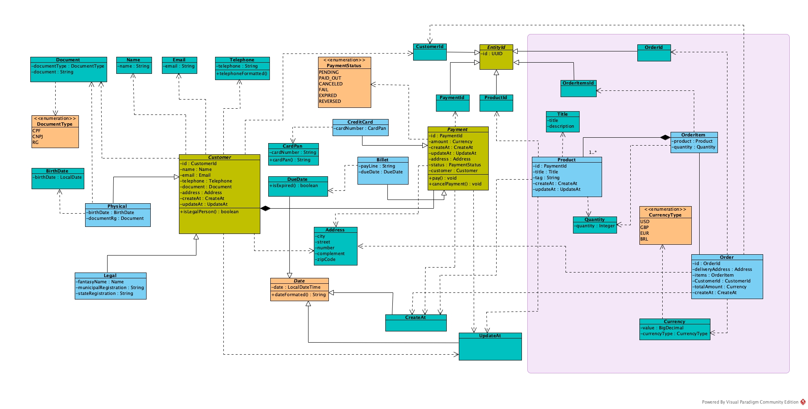
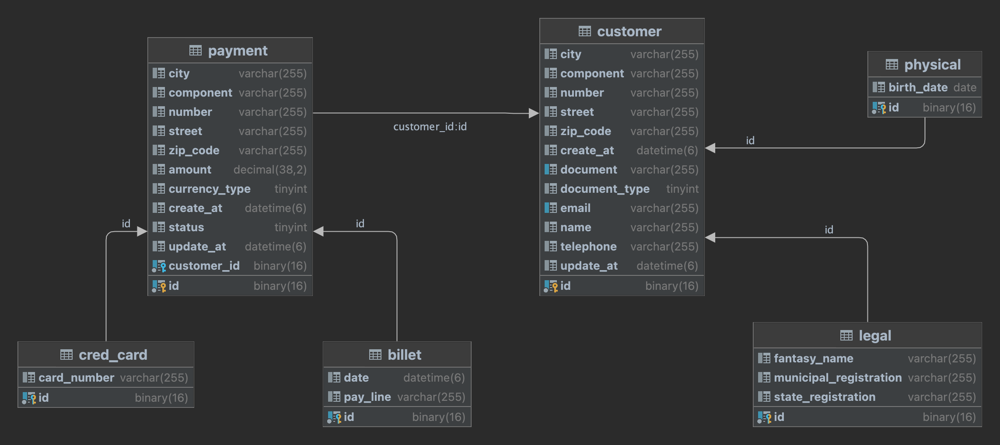
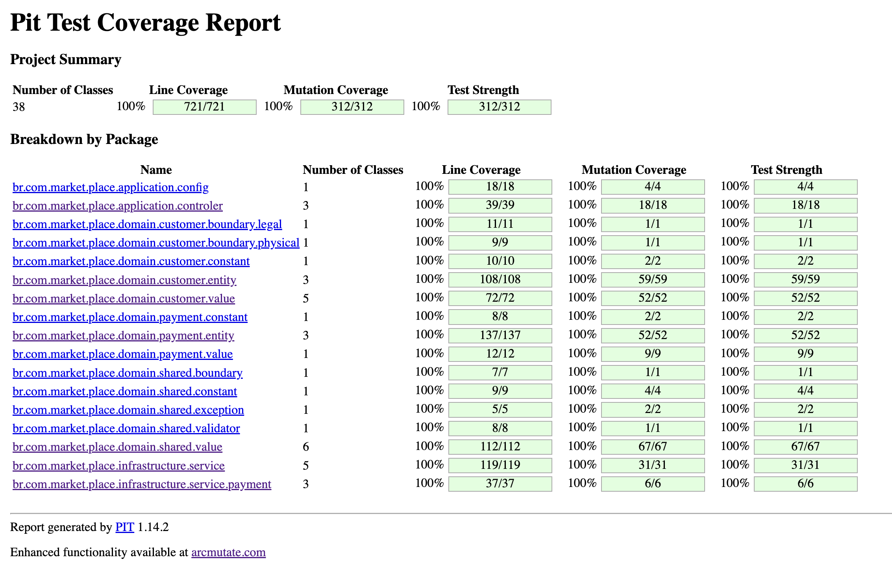

## MARKET-PLACE

<p>
    The aim of this project is to propose a software developer that is simple and focused on business!
    It is very common in developer scenarios for a team to start a new project and during the process 
    lose track of their goal. The project results in a different solution from what was expected, with the business rules 
    spreading through all system layers.
    Adding a new functionality is supposed to be simple, but it can become a nightmare.
    Therefore,  I use the concepts of rich domain, don't repeat yourself(DRY) and anti-corruption layers to be able 
    to deliver a solution with high cohesion and low coupling focusing on stability.
    With this proposal of architecture, we will be able to achieve 100% of tests coverages and ensure that our application 
    has high quality.
</p>

The patterns used:
 - Value object
 - Service domain
 - Aggregate
 - Entity
 - Design by contract
 - Anti-corruption layer
 - Rich domain
 - Ubiquitous language
 - Clean code
 - Test Driven Design(TDD)
 - Mutation test
 - Command Query Separation(CQS)

---
## Domain
See below the domain diagram, it describes the solutions.

#### Class diagram



#### Database diagram


---
## how to Run the project
This project runs on docker, using docker-compose to manage the solution.

> ### Fist, build the application
> ``` 
> sh hooks/build-image
> ```
After building the application, go ahead to the next step

> ### Two, run the solution
> ``` 
> sh hooks/up-container
> ```
Done, now the application is running on your machine! 
The application can be tested.

---
## Tests
In this project we used JUnit 5 and Pitest for mutation and assurance of project quality!

> ### Running project test
> ``` 
> mvn clean test
> ```

You can see the result of the test in the path `target/pit-reports/index.html`



---
### Resources

This project uses Rest protocol and returns data in json format.

> #### CREATE LEGAL CUSTOMER
> A legal customer represents a company!
> The attributes "email" and "cnpj" are unique!
> 
> ```http request
> POST /v1/api/customer/legal
>  Content-Type: application/json
>  Accept: application/json
> 
>  {
>    "name": "Alana e Guilherme",
>    "telephone": "1138384351",
>    "email": "qualidade@alanaeguilhermeconstrucoesltda.com.br",
>    "cnpj": "77111888000164",
>    "fantasyName": "Alana e Guilherme Construções Ltda",
>    "municipalRegistration": "1512994",
>    "stateRegistration": "151299495372",
>    "address": {
>       "city": "Santa Rita do Sapucai",
>       "street": "Joaquim Teles de Souza",
>       "number": "80",
>       "component": "APT 102",
>       "zipCode": "37540000"
>    }
>  }
> ```
#### Response
If your request returns a status code different from 201, your request has failed, so it returns the following body response:
```
{
  "data": {
    "message": "<Error message>"
  },
  "success": false
}
```

| Status Code | message                                |
|-------------|----------------------------------------|
| 201         |                                        |
| 422         | E-mail or document needs to be unique! |
| 422         | Attribute name is required!            |
| 422         | Attribute telephone is invalid!        |

---

> #### CREATE PHYSICAL CUSTOMER
> The attributes "email" and "document" are unique!
>
> ```http request
>   POST /v1/api/customer/physical
>   Content-Type: application/json
>   Accept: application/json
>
>    {
>       "name": "Marlon Reis",
>       "email": "marlon-reis@email.com",
>       "telephone": "35999912134",
>       "document": "41953736033",
>       "documentType": "CPF",
>       "birthDate": "31/12/1991",
>       "address": {
>           "city": "Santa Rita do Sapucai",
>           "street": "Joaquim Teles de Souza",
>           "number": "80",
>           "component": "APT 102",
>           "zipCode": "37540000"
>       }
>   }
> ```
#### Response
If your request returns a status code different from 201, your request has failed, so it returns the following body response:
```
{
  "data": {
    "message": "<Error message>"
  },
  "success": false
}
```

| Status Code | message                                |
|-------------|----------------------------------------|
| 201         |                                        |
| 422         | E-mail or document needs to be unique! |
| 422         | Attribute name is required!            |
| 422         | Attribute telephone is invalid!        |

---

> #### FIND CUSTOMER BY DOCUMENT
> Find Legal as well as physical customer, but the difference between both is that for legal customers we use "CNPJ" and for physical ones we might
> use "CPF" or "RG".
>
> ```http request
>   GET /v1/api/customer/physical/document/<CUSTOMER'S DOCUMENT>/<KIND OF DOCUMENT>
>   Content-Type: application/json
>   Accept: application/json
> ```
#### Response
If your request returns a status code different from 200, your cannot find the customer by document!
```
{
    "data": {
        "customerId": "0183b785-9ac8-47d3-8269-dbd07b46e28c",
        "name": "Marlon Reis",
        "email": "marlon-reis@email.com",
        "telephone": "35999912134",
        "document": "41953736033",
        "address": {
            "address": "Joaquim Teles de Souza, 80, APT 102, Santa Rita do Sapucai, 37540000"
        }
    },
    "success": true
}
```

| Status Code | message                                    |
|-------------|--------------------------------------------|
| 200         |                                            |
| 422         | Attribute document of type CPF is invalid! |
| 404         | Customer not found by document!            |

---

> #### CREATE BILLET PAYMENT
> This represents a billet customer transaction! 
> We can work with different types of currencies like BRL, USD and GBP in this request!
>
> ```http request
>   POST /v1/api/payment/billets
>   x-customer-id: <CUSTOMER ID>
>   Content-Type: application/json
>
>   {
>       "amount": "281",
>       "currencyType": "GBP", 
>       "address": {
>           "city": "Auertown",
>           "street": "Garry Bashirian",
>           "number": "327",
>           "component": "APT 46",
>           "zipCode": "37540000"
>       }
>   }
> ```
#### Response

| Status Code | message                                         |
|-------------|-------------------------------------------------|
| 201         |                                                 |
| 422         | Attribute amount is invalid!                    |
| 404         | Customer not found                              |
| 400         | Required header 'x-customer-id' is not present. |
---

> #### CREATE CREDIT CARD PAYMENT
> It represents a credit card customer transaction!
> Here we can work with different type of currencies like BRL, USD and GBP too!
> In the real world we do not use the card pan decrypted, but here we used it as an example!
> 
> ```http request
>   POST /v1/api/payment/credit-card
>   x-customer-id: <CUSTOMER ID>
>   Content-Type: application/json
>
>   {
>       "cardNumber": "5273548390118161",
>       "amount": "875",
>       "currencyType": "GBP",
>       "address": {
>           "city": "Roseville",
>           "street": "Nicole Wiza",
>           "number": "189",
>           "component": "APT 403",
>           "zipCode": "37540000"
>       }
>   }
> ```
#### Response

| Status Code | message                                         |
|-------------|-------------------------------------------------|
| 201         |                                                 |
| 422         | Attribute cardNumber is invalid!                |
| 404         | Customer not found                              |
| 400         | Required header 'x-customer-id' is not present. |
---

> #### FIND CREDIT CARD PAYMENT BY CUSTOMER ID 
> It returns all customer credit card payments
>
> ```http request
>   POST /v1/api/payment/credit-card/<CUSTOMER ID>
>   Content-Type: application/json
> ```
#### Response

```
{
    "data": [
        {
            "paymentId": "c77f95da-ec66-43bd-b79e-7165e2b6dfed",
            "cardPan": "5273********8161",
            "fullName": "Marlon Reis",
            "document": "41953736033",
            "documentType": "CPF",
            "amount": "£875.00",
            "status": "PENDING",
            "createAt": "09/08/2023 00:46:25"
        },
        {
            "paymentId": "ff737526-d42d-4493-b6e8-e3f64e7f8691",
            "cardPan": "5273********8161",
            "fullName": "Marlon Reis",
            "document": "41953736033",
            "documentType": "CPF",
            "amount": "R$ 875.00",
            "status": "PENDING",
            "createAt": "09/08/2023 00:46:23"
        }
    ],
    "success": true
}
```

| Status Code | message                                                     |
|-------------|-------------------------------------------------------------|
| 200         |                                                             |
| 404         | It wasn't possible to find credit card payment by customer! |
| 422         | Id 1993faf6-2fad-4ba7-a3ee-2dbbcab67a9Q is invalid!         |
---

> #### FIND BILLET PAYMENT BY CUSTOMER ID
> It return all customer billet payments
>
> ```http request
>   POST /v1/api/payment/billets/<CUSTOMER ID>
>   Content-Type: application/json
> ```
#### Response

```
{
    "data": [
        {
            "paymentId": "afb1b9f2-76bb-436a-a6ab-a7a54e9a101a",
            "dueDate": "12/08/2023",
            "document": "41953736033",
            "documentType": "CPF",
            "fullName": "Marlon Reis",
            "payLine": "50699305351994616481974931645058343819953078924745",
            "amount": "R$ 629,00",
            "status": "PENDING"
        },
        {
            "paymentId": "41b101a0-680f-4293-a3b1-8c1a39787718",
            "dueDate": "12/08/2023",
            "document": "41953736033",
            "documentType": "CPF",
            "fullName": "Marlon Reis",
            "payLine": "10975978653354546880723961748489001294918555152472",
            "amount": "£267.00",
            "status": "PENDING"
        }
    ],
    "success": true
}
```

| Status Code | message                                                   |
|-------------|-----------------------------------------------------------|
| 200         |                                                           |
| 404         | Cannot be possible to find cred card payment by customer! |
| 422         | Id 1993faf6-2fad-4ba7-a3ee-2dbbcab67a9Q is invalid!       |
---

> #### RUN PAYMENT
> It's run payment either credit card or billet.
>
> ```http request
>   POST /v1/api/payment/pay
>   x-payment-id: <PAYMENT ID>
>   Content-Type: application/json
> ```
#### Response

| Status Code | message                                                        |
|-------------|----------------------------------------------------------------|
| 200         |                                                                |
| 404         | Cannot be found payment by id                                  |
| 422         | Cannot run cred card payment with status different of pending! |
---

> #### RUN PAYMENT
> It's cancel payment either credit card or billet.
>
> ```http request
>   POST /v1/api/payment/cancel
>   x-payment-id: <PAYMENT ID>
>   Content-Type: application/json
> ```
#### Response

| Status Code | message                                     |
|-------------|---------------------------------------------|
| 200         |                                             |
| 404         | Cannot be found payment by id               |
| 422         | Cannot cancel payment with status REVERSED! |
---
